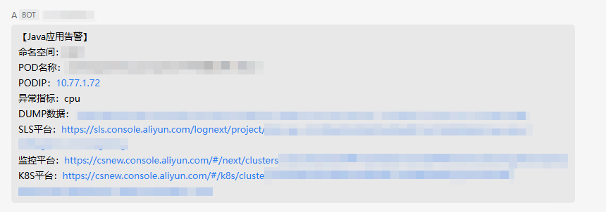

## 说明
基于arthas实现的kubernetes环境下java应用资源异常自动dump内存数据和繁忙线程，便于研发和运维排查异常问题。

## 权限绑定
#### ClusterRole配置
```bash
cat > pod-operations-clusterrole.yaml << EOF
apiVersion: rbac.authorization.k8s.io/v1
kind: ClusterRole
metadata:
  name: pod-operations
rules:
- apiGroups: [""]
  resources: ["pods"]
  verbs: ["list"]
- apiGroups: [""]
  resources: ["pods/exec"]
  verbs: ["list","watch","get","exec","create"]
- apiGroups: ["metrics.k8s.io"]
  resources: ["pods"]
  verbs: ["get", "list", "watch"]
EOF
```
#### serviceAccount配置
```bash
cat > serviceaccount.yaml << EOF
apiVersion: v1
kind: ServiceAccount
metadata:
  name: pod-operations-serviceaccount
  namespace: appna
EOF
```

#### ClusterRoleBinding配置
```bash
cat > pod-operations-clusterrolebinding.yaml << EOF
apiVersion: rbac.authorization.k8s.io/v1
kind: ClusterRoleBinding
metadata:
  name: bind-pod-operations
subjects:
- kind: ServiceAccount
  name: pod-operations-serviceaccount
roleRef:
  kind: ClusterRole
  name: pod-operations
  apiGroup: rbac.authorization.k8s.io
EOF
```

##### 发布到集群
```bash
kubectl apply -f pod-operations-clusterrole.yaml
kubectl apply -f serviceaccount.yaml -n appna #替换成实际的命名空间
kubectl apply -f pod-operations-clusterrolebinding.yaml -n appna #替换成实际的命名空间
```

#### 业务镜像需求
- pidof、jvm指令必须

#### 环境变量设置
- `NAMESPACE`: 命名空间，多个用英文逗号隔开
- `DOWNLOAD_HOST`: dump数据下载地址
- `WECOM_ROBOT_ADDR`: 企业微信机器人地址, 多个用英文逗号隔开

#### 示例数据

